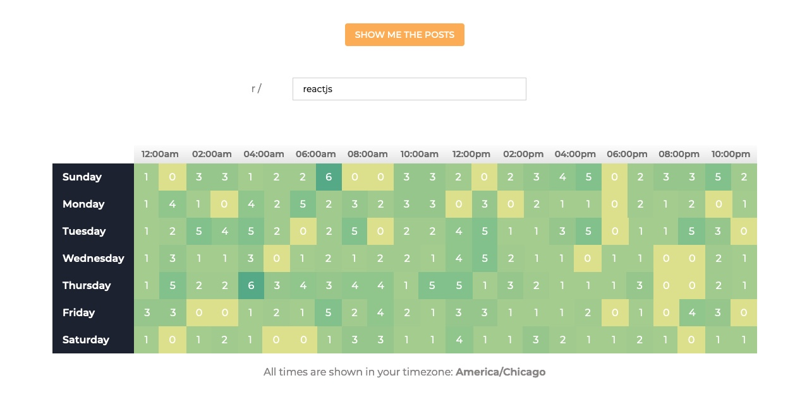

[Demo](https://614926f0cc32890008b43f19--gallant-almeida-8d5e6c.netlify.app/)

# Reddit Timer
A social media analytical tool that scrapes posts from the last full week with respect to present day and distributes in an interactive heatmap.

# Features

- Allows user to scrape post meta data across any reddit community
- User interactive heatmap that display exactly what time of the day any posts has been submitted.
- Selecting any cell on the heatmap renders a table containing every post appropriate to the time interval, including additional meta data such as author and comment count and hyperlinks to them.

# Technologies
React | JavaScript | Styled Components | pushshift.io API

# Issues
Search Speed
The search feature isnt as quick as I would have like it. This is because there was quite a bit of logic that went into grabbing the last full week from the user's present day and splitting it into one hour segments. On top of that, when the fetch request is submitted, it then gets parsed by it's post time and sorted into any cell containing the correct interval. The renders seem to be optimal, there is a re-render of 128 cells so that also likely plays a part in the search time. In conclusion, I'd bet that this speed is due to considerable amount of logic that went into it. Optimizing the logic would be the best way to increate the speed in my opinion.

# Latency with Selecting Cells
There's a small latency when selecting between different time intervals: It's not unnoticeable but it's not unusable either. This is because the onClick event that manages the state of whether or not a cell is selected only true: theres a useEffect takes event to verify that the object of the cell thats selected is idential to the object that is selected in the parent component. This leads to a useEffect taking place in every cell, which causes there to be a bit of latency. This was just the solution that I came up with for this particular problem so there may be a more optimal solution out there.

# Request Cap
The biggest flaw with this tool is that the API caps any get request to 100 posts, which I didnt realize until I created all the logic for retrieving it (the documentation said the cap was 500 posts). The best I could do without completeley overhauling my logic was to loop over every day of the week and make 100 requests per day. Unfortunately this means that the heatmap won't accurately generate the posts of a subreddit that usually or happens to have over 700 posts of the past week. It works as expected for moderately sized ones, but bigger ones such as r/askreddit won't give an accurate heatmap.

Full Disclosure: This project was inspired by Johannes over at profy.dev. It's a project he builds from scratch in one of his courses and I thought it was pretty interesting so I decided to give it a try. Since I didn't want to shell out the money for access to the entire course, I took the figma design and the basic functionality of the finished product and implemented it on my own.
